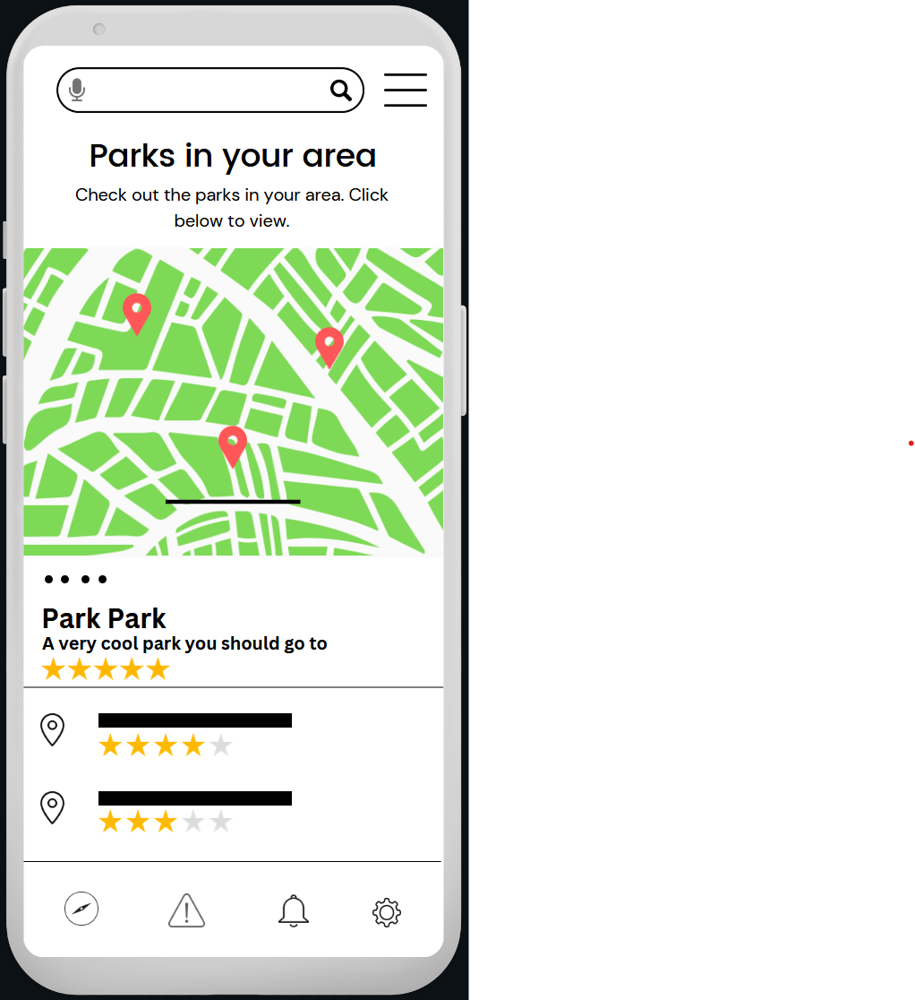
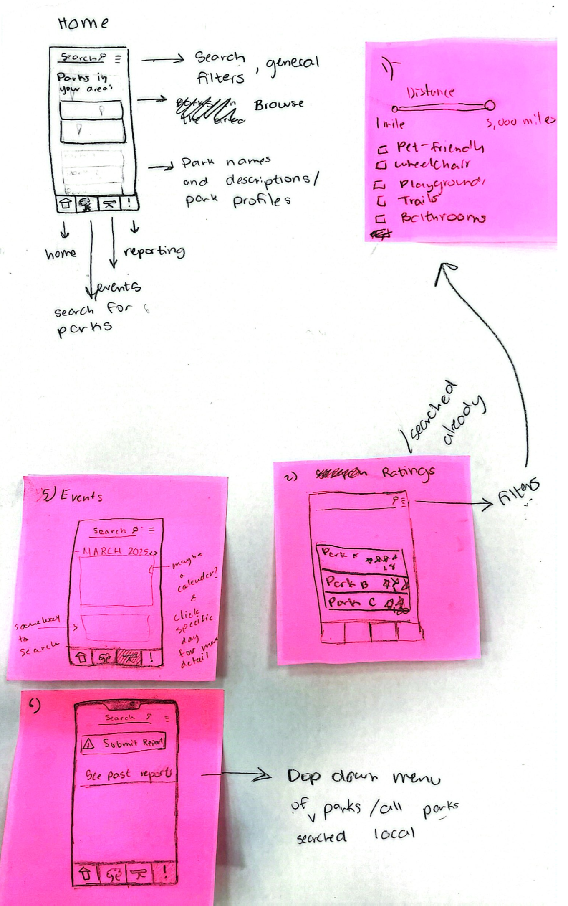
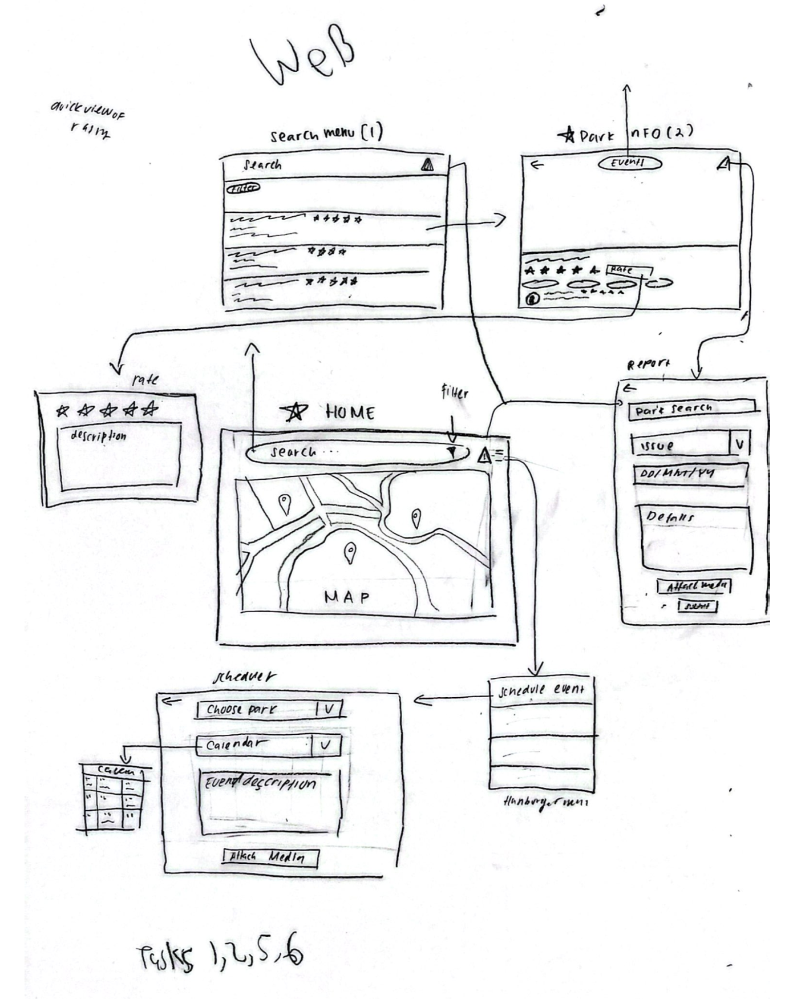
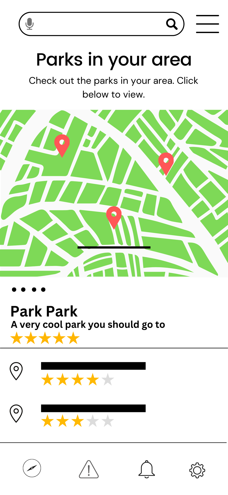
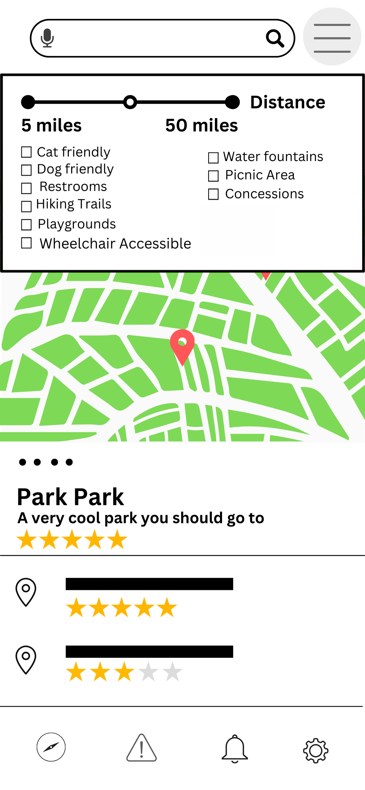
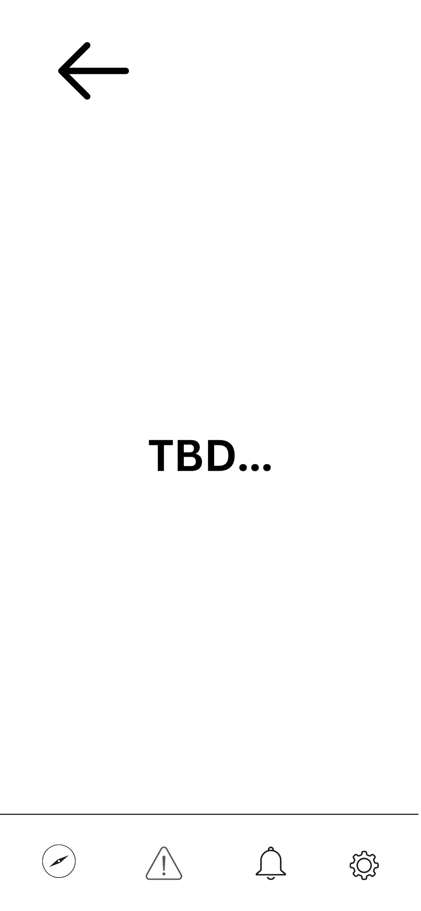

# 🌳 Park Platform Design Challenge

## 📌 Project Overview

The **Park Platform Design Challenge** aims to create a **centralized platform** for
neighborhood park information.  
Users can **search for parks with specific features**, read ratings, report safety issues, and
find events.  
This project was developed as part of a **computer science design challenge**, with a focus on
**usability, accessibility, and user-driven feedback**.

---

## 📌 Repository Structure

    Park-Platform-Design-Challenge/
    ├── README.md
    ├── assets/
    ├── Prototype/          (Design images + screenshots)
    │   ├── Mobile/
    │   ├── Web/
    ├── Task-Descriptions/  (Short-Listed Tasks)
    ├── Feedback/           (Peer feedback and updates made)
    ├── Research/           (Brainstorming)

___

## 🎯 Key Features

✔ **Search for parks** based on location & features  
✔ **Filter parks** by **accessibility (wheelchair, pet-friendly, etc.)**  
✔ **View ratings & reviews** from the community  
✔ **Report safety issues & maintenance problems**  
✔ **Find & organize local park events**

---

## 📱 Live Prototype Demo

### 🎥 Mobile Platform:

🔗 **Click to view the full prototype on Canva**
[**<u>here
</u>**](https://www.canva.com/design/DAGgyg7zKoQ/E1ChejLl6TJYac0AhMemow/view?mode=prototype)

___

## 🧠 Research & Brainstorming

This project was developed through an **iterative design process**, incorporating **user
research, brainstorming, and peer feedback**.

### 🔍 Short-Listed Tasks:

✅ **Task 1: Park Search & Filters** (Playgrounds, pet-friendly, accessibility)  
✅ **Task 2: Ratings & Reviews** (Consolidating feedback from different sources)  
✅ **Task 5: Safety Reporting** (Quick issue submission for park conditions)  
✅ **Task 6: Event Planning** (Organizing park-based activities)

### 📝 Key Insights from Brainstorming:

- **Search Bar + Filters**: Allow users to filter parks based on features (playgrounds, trails,
  restrooms).
- **Park Profiles**: Each park should have **user-submitted features & images**.
- **Safety Reporting**: Enable anonymous issue reports (trash, broken equipment, vandalism).
- **Events Tab**: Users can submit or view **community park events** (cleanups, gatherings,
  sports).

🔗 See more details in our [**`Task-Descriptions/initial-design-brainstorming-notes.md`**](
Task-Descriptions/initial-design-brainstorming-notes.md).

---

## 🔍 Selected Task: **Park Search & Filters (Task 1)**

### **Why We Focused on This Task**

✅ **Foundation of the platform** – Searching is the **first step** before reviews, reports, or
events.  
✅ **Allows customization** – Users can **filter parks by features (playgrounds, pet-friendly,
etc.)**.  
✅ **Enables accessibility enhancements** – **Voice search, larger icons, and simplified UI**
improve usability.

🔗 **Read full writeup in: [
`Task-Descriptions/task-1-search.md`](
Task-Descriptions/task-1-search.md).**

---

## 🎨 Initial Design Sketches

Before developing the **digital prototype**, we explored **low-fidelity sketches** to map out
user flows.

### 📱 **Mobile Interface Sketch**

### 🖥️ **Web Interface Sketch**

🔗 **Browse all sketches & screenshots: [`Prototype/`](Prototype).**

---

## 📢 Feedback & Iterations

Throughout the design process, we **iterated based on peer feedback**:  
✔ **Larger icons & clearer UI**  
✔ **Voice search microphone for accessibility**  
✔ **More intuitive navigation & map updates**

📌 **Feedback Summary:** See [`Feedback/`](Feedback)

---

## 🖥️ Screenshots

### 🌳 Home Page & Park Rating

### 🔍 Search & Filter System

### 📝 Report Submission Form

___

## 🤝 Team Members

- [**Komalpreet Dhaliwal**](https://www.linkedin.com/in/komalpreet-dhaliwal-kaur843/)
- [**Lily Hoopes**](https://www.linkedin.com/in/lily-hoopes/)
- [**Ryder DeBack**](https://www.linkedin.com/in/ryder-deback/)
- [**Rhea Mimi Carillo**](https://www.linkedin.com/in/rhea-carillo/)
- [**Naziira Hemeto**](https://www.linkedin.com/in/nhemeto/)
- [**Anwar Noor**](https://www.linkedin.com/in/anwar-noor/)

---

