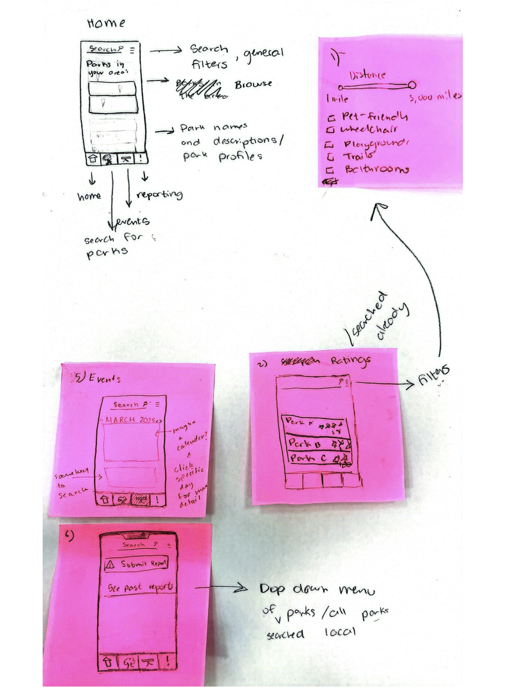

# 🌳 Park Platform Design Challenge

## 📌 Project Overview

The **Park Platform Design Challenge** aims to create a **centralized platform** for
neighborhood park information.  
Users can **search for parks with specific features**, read ratings, report safety issues, and
find events.  
This project was developed as part of a **computer science design challenge**, with a focus on
**usability, accessibility, and user-driven feedback**.

---

## 🎯 Key Features

✔ **Search for parks** based on location & features  
✔ **Filter parks** by **accessibility (wheelchair, pet-friendly, etc.)**  
✔ **View ratings & reviews** from the community  
✔ **Report safety issues & maintenance problems**  
✔ **Find & organize local park events**

---

## 📱 Live Prototype Demo

### 🎥 Mobile Prototype Demo:

---

## 🎨 Initial Design Sketches

Before developing the **digital prototype**, we explored **low-fidelity sketches** to map out
user flows.

### 🖥️ **Web Interface Sketch**

### 📱 **Mobile Interface Sketch**

🔗 **See more sketches in [`Research/`](Research/).**

---

## 🔍 Selected Task: **Park Search & Filters (Task 1)**

### **Why We Focused on This Task**

✅ **Foundation of the platform** – Searching is the **first step** before reviews, reports, or
events.  
✅ **Allows customization** – Users can **filter parks by features (playgrounds, pet-friendly,
etc.)**.  
✅ **Enables accessibility enhancements** – **Voice search, larger icons, and simplified UI**
improve usability.

---

## 🧠 Research & Brainstorming

This project was developed through an **iterative design process**, incorporating **user
research, brainstorming, and peer feedback**.

📄 **Full Brainstorming Notes:** [
`Research/Week7-8-Brainstorming.pdf`](Research/Week7-8-Brainstorming.pdf)

### 🔍 Short-Listed Tasks:

✅ **Task 1: Park Search & Filters** (Playgrounds, pet-friendly, accessibility)  
✅ **Task 2: Ratings & Reviews** (Consolidating feedback from different sources)  
✅ **Task 5: Safety Reporting** (Quick issue submission for park conditions)  
✅ **Task 6: Event Planning** (Organizing park-based activities)

### 📝 Key Insights from Brainstorming:

- **Search Bar + Filters**: Allow users to filter parks based on features (playgrounds, trails,
  restrooms).
- **Park Profiles**: Each park should have **user-submitted features & images**.
- **Safety Reporting**: Enable anonymous issue reports (trash, broken equipment, vandalism).
- **Events Tab**: Users can submit or view **community park events** (cleanups, gatherings,
  sports).

🔗 See more details in our **[`Research/`](Research/) folder**.

---

## 📢 Feedback & Iterations

Throughout the design process, we **iterated based on peer feedback**:  
✔ **Larger icons & clearer UI**  
✔ **Voice search microphone for accessibility**  
✔ **More intuitive navigation & map updates**

📌 **Feedback Summary:** See [`Feedback/peer-review-notes.md`](Feedback/peer-review-notes.md)

---

## 🖥️ Screenshots

### 🔍 Search & Filter System

### 📝 Feedback & Updates

___

## 🤝 Team Members

- **Komalpreet Dhaliwal**
- **Lily Hoopes**
- **Ryder DeBack**
- **Rhea Mimi Carillo**
- **Naziira Hemeto**
- **Anwar Noor**

---

## 📌 Repository Structure

    Park-Platform-Design-Challenge/
    ├── README.md
    ├── assets/
    │   ├── park-mockup.png
    │   ├── mobile-demo.gif
    │   ├── search-filters.png
    │   ├── feedback-summary.png
    ├── Prototype/
    │   ├── Mobile/  (Mobile prototype screenshots + interactive link)
    │   ├── Web/      (Web prototype screenshots)
    ├── Task-Descriptions/
    ├── Feedback/ (Peer feedback and updates made)
    ├── Research/
    │   ├── Park-Platform-Design-Challenge-Notes/Brainstorming.pdf