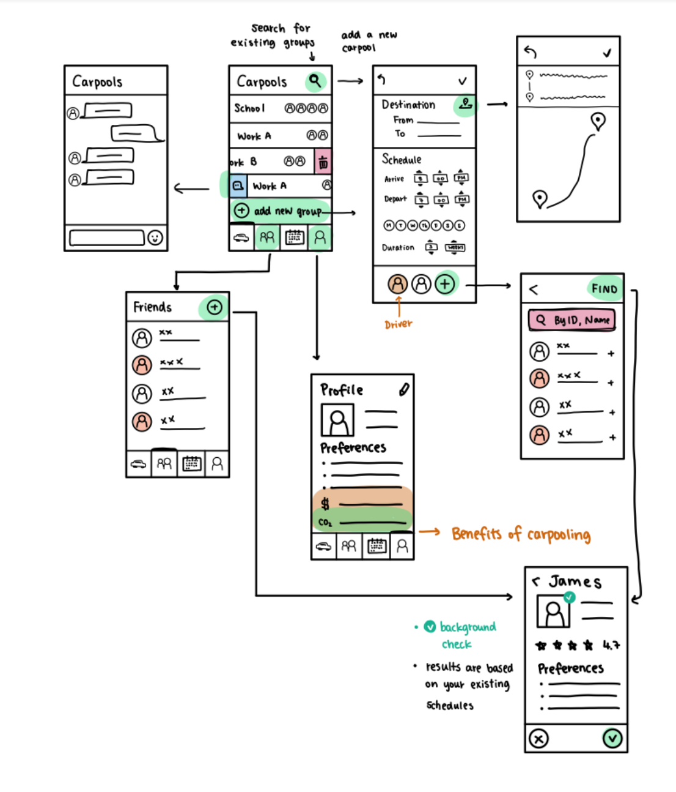
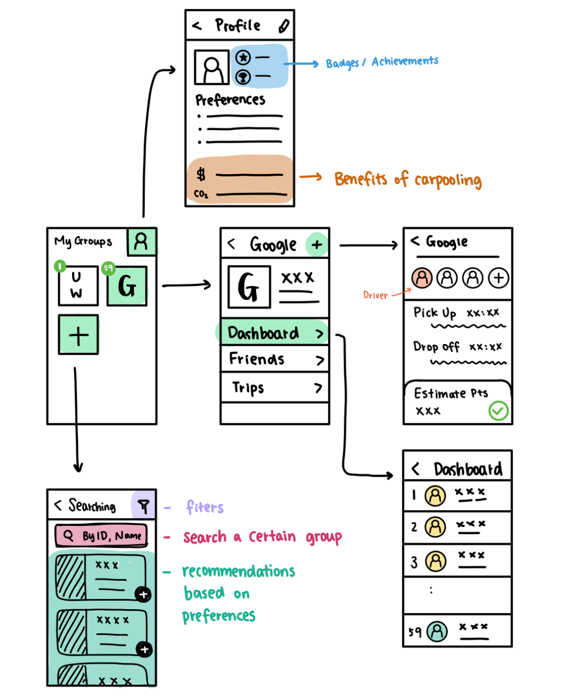
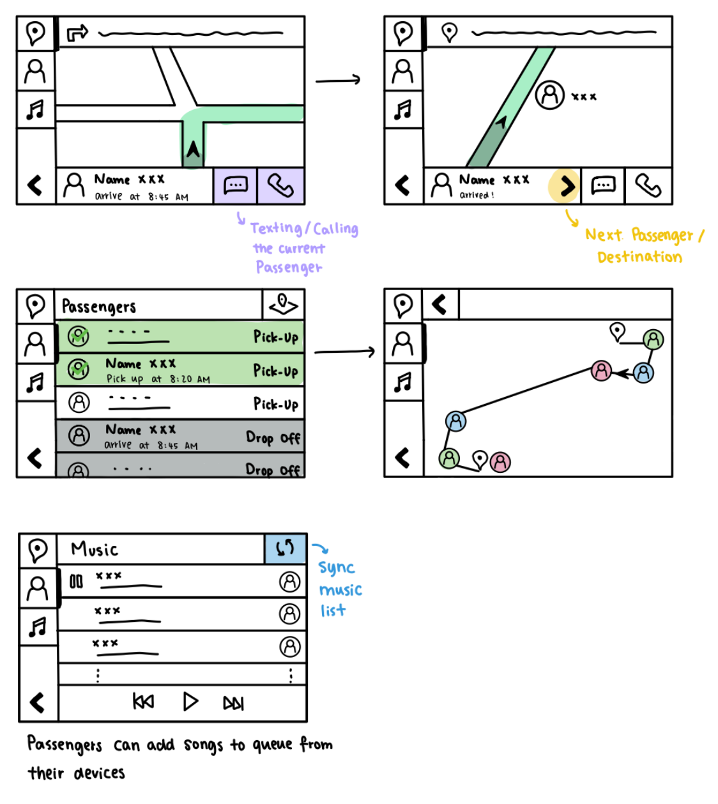

# 🧠 Park Platform Design Challenge Brainstorming Summary

## 📌 Overview

In our initial discussions, our team **brainstormed & analyzed key challenges** related to
neighborhood park
information-sharing.  
We explored potential **user needs, feature ideas, and example sketches**.

📄 **Full Brainstorming Notes:** [
`Park-Platform-Design-Challenge-Brainstorming-Notes.pdf`](Park-Platform-Design-Challenge-Brainstorming-Notes.pdf)

---

## 🔍 Key Insights from Brainstorming

### **Short-Listed Tasks**

| Task       | Description                                                                            |
|------------|----------------------------------------------------------------------------------------|
| **Task 1** | Searching for parks with specific features (playground, pet-friendly, restrooms, etc.) |
| **Task 2** | Viewing reviews & ratings for parks                                                    |
| **Task 5** | Reporting safety issues or maintenance concerns                                        |
| **Task 6** | Searching for events or organizing park-based functions                                |

### **📝 Notable Feature Ideas**

✔ **Search Filters:** Allow filtering by **playgrounds, pet-friendliness, restrooms, trails**  
✔ **Map Integration:** Show **pins for parks** that match search criteria  
✔ **User Reviews & Ratings:** Sortable by **most recent, highest rating, or most relevant**  
✔ **Quick Report Button:** Enable easy issue reporting (**trash, vandalism, broken equipment
**)  
✔ **Event Creation & RSVP:** Users can **submit & manage events**

---

## 🎨 Example Concept Sketches

These sketches were **referenced during our initial meetings** to visually explore
**how users interact with a virtual platform**.

### **Home & Search Page**

### **Profiles & Filters**

### **Map Integration**

---

## 🔮 How This Shaped Our Design

Based on these discussions, we refined **Task 1 (Park Search & Filters)** as the
**core feature** for our **digital prototype**.

🔗 **Next Steps:** See our final prototype in the **[`Prototype/`](../Prototype/)** folder.

---
